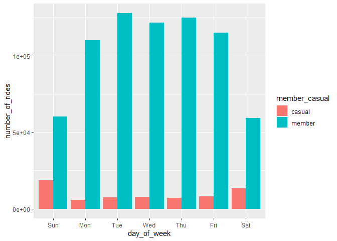
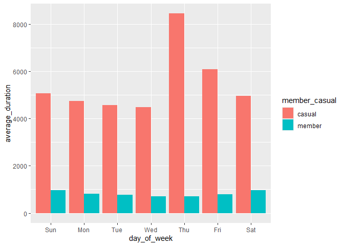

Cyclistic Bike-Share Analysis: Usage Patterns of Members vs. Casual
Riders
================
Toheeb M.
2025-11-16

- [Executive Summary](#executive-summary)
- [1. Business Task](#1-business-task)
- [2. Data Sources](#2-data-sources)
- [3. Load Libraries](#3-load-libraries)
- [4. Import Raw Data](#4-import-raw-data)
- [5. Data Cleaning & Preparation](#5-data-cleaning--preparation)
  - [5.1 Harmonize column names](#51-harmonize-column-names)
  - [5.2 Standardize data types](#52-standardize-data-types)
  - [5.3 Combine datasets](#53-combine-datasets)
  - [5.4 Remove discontinued
    variables](#54-remove-discontinued-variables)
- [6. Feature Engineering](#6-feature-engineering)
  - [6.1: Standardize rider
    catrgories](#61-standardize-rider-catrgories)
  - [6.2 Extract date components](#62-extract-date-components)
  - [6.3 Calculate ride length](#63-calculate-ride-length)
  - [6.4 Remove invalid entries (negative durations, “HQ QR” maintenance
    rides)](#64-remove-invalid-entries-negative-durations-hq-qr-maintenance-rides)
- [7. Descriptive Analysis](#7-descriptive-analysis)
  - [7.1 Overall ride duration
    statistics](#71-overall-ride-duration-statistics)
  - [7.2 Compare members vs casual
    riders](#72-compare-members-vs-casual-riders)
  - [7.3 Daily riding patterns](#73-daily-riding-patterns)
- [8. Visualizations](#8-visualizations)
  - [8.1 Number of rides by user type and
    day](#81-number-of-rides-by-user-type-and-day)
  - [8.2 Average ride duration by user type and
    day](#82-average-ride-duration-by-user-type-and-day)
- [9. Key Findings (Interpretation)](#9-key-findings-interpretation)
- [10. Recommendations](#10-recommendations)
- [11. Export Data for Further Analysis (e.g., in Tableau or
  spreadsheets)](#11-export-data-for-further-analysis-eg-in-tableau-or-spreadsheets)

## Executive Summary

Cyclistic, a fictional Chicago-based bike-share program, aims to
increase annual memberships, which generate significantly higher
long-term revenue than single-ride or day-pass purchases. To support
this strategic priority, this analysis investigates a key question:

> How do annual members and casual riders use Cyclistic bikes
> differently?

Using historical trip data from Q1 2019 and Q1 2020, I cleaned,
harmonized, and merged datasets; engineered time-based features;
examined ride behavior patterns; and generated insights to guide
targeted marketing strategy.

Key findings include:

- Members take more rides, but
- Casual riders take substantially longer rides, contributing more
  revenue under a pay-per-ride model.
- Weekday vs weekend patterns differ sharply:
  - Members ride heavily on weekdays → commuter behavior
  - Casual riders ride more on weekends → recreational use
- Trip duration differences persist across all days of the week

These findings suggest membership campaigns should target casual riders
who appear to use bikes for leisure but may benefit from cost savings or
convenience associated with membership.

## 1. Business Task

Cyclistic leadership wants to understand behavioral differences between
annual members and casual riders in order to:

1.  Increase annual memberships
2.  Improve marketing segmentation
3.  Identify opportunities to convert casual riders into members

This analysis focuses on the first guiding question:

> How do annual members and casual riders use Cyclistic bikes
> differently?

## 2. Data Sources

Two datasets were provided (Divvy/Cyclistic public data):

- Divvy_Trips_2019_Q1.xlsx
- Divvy_Trips_2020_Q1.xlsx

These include individual trip-level data with timestamps, bike type,
station metadata, and rider category.

**Limitations**:

- Data only includes Q1 (winter months) → seasonal usage patterns not
  captured.
- Demographic attributes were removed from 2020 onward → less ability to
  segment customer profiles.
- Trip data cannot identify revenue directly.

## 3. Load Libraries

``` r
if (!requireNamespace("pacman", quietly = TRUE)) install.packages("pacman")

pacman::p_load(here, tidyverse, sessioninfo)
```

## 4. Import Raw Data

``` r
q1_2019 <- readxl::read_xlsx(here::here("data", "Divvy_Trips_2019_Q1.xlsx")) # Q1 2019 data set
q1_2020 <- readxl::read_xlsx(here::here("data", "Divvy_Trips_2020_Q1.xlsx")) # Q1 2020 data set
```

## 5. Data Cleaning & Preparation

### 5.1 Harmonize column names

Review column names in each data set

``` r
colnames(q1_2019)
```

    ##  [1] "trip_id"           "start_time"        "end_time"         
    ##  [4] "bikeid"            "tripduration"      "from_station_id"  
    ##  [7] "from_station_name" "to_station_id"     "to_station_name"  
    ## [10] "usertype"          "gender"            "birthyear"

``` r
colnames(q1_2020) 
```

    ##  [1] "ride_id"            "rideable_type"      "started_at"        
    ##  [4] "ended_at"           "start_station_name" "start_station_id"  
    ##  [7] "end_station_name"   "end_station_id"     "start_lat"         
    ## [10] "start_lng"          "end_lat"            "end_lng"           
    ## [13] "member_casual"

The 2019 dataset uses earlier naming conventions. I align them to the
2020 schema:

``` r
q1_2019 <- q1_2019 %>%
  rename(
    ride_id = trip_id,
    rideable_type = bikeid,
    started_at = start_time,
    ended_at = end_time,
    start_station_name = from_station_name,
    start_station_id = from_station_id,
    end_station_name = to_station_name,
    end_station_id = to_station_id,
    member_casual = usertype
    )
```

### 5.2 Standardize data types

I inspect the data frames and look for incongruencies:

``` r
str(q1_2019)
```

    ## tibble [365,069 × 12] (S3: tbl_df/tbl/data.frame)
    ##  $ ride_id           : num [1:365069] 21742443 21742444 21742445 21742446 21742447 ...
    ##  $ started_at        : POSIXct[1:365069], format: "2019-01-01 00:04:37" "2019-01-01 00:08:13" ...
    ##  $ ended_at          : POSIXct[1:365069], format: "2019-01-01 00:11:07" "2019-01-01 00:15:34" ...
    ##  $ rideable_type     : num [1:365069] 2167 4386 1524 252 1170 ...
    ##  $ tripduration      : num [1:365069] 390 441 829 1783 364 ...
    ##  $ start_station_id  : num [1:365069] 199 44 15 123 173 98 98 211 150 268 ...
    ##  $ start_station_name: chr [1:365069] "Wabash Ave & Grand Ave" "State St & Randolph St" "Racine Ave & 18th St" "California Ave & Milwaukee Ave" ...
    ##  $ end_station_id    : num [1:365069] 84 624 644 176 35 49 49 142 148 141 ...
    ##  $ end_station_name  : chr [1:365069] "Milwaukee Ave & Grand Ave" "Dearborn St & Van Buren St (*)" "Western Ave & Fillmore St (*)" "Clark St & Elm St" ...
    ##  $ member_casual     : chr [1:365069] "Subscriber" "Subscriber" "Subscriber" "Subscriber" ...
    ##  $ gender            : chr [1:365069] "Male" "Female" "Female" "Male" ...
    ##  $ birthyear         : num [1:365069] 1989 1990 1994 1993 1994 ...

``` r
str(q1_2020)
```

    ## tibble [426,887 × 13] (S3: tbl_df/tbl/data.frame)
    ##  $ ride_id           : chr [1:426887] "EACB19130B0CDA4A" "8FED874C809DC021" "789F3C21E472CA96" "C9A388DAC6ABF313" ...
    ##  $ rideable_type     : chr [1:426887] "docked_bike" "docked_bike" "docked_bike" "docked_bike" ...
    ##  $ started_at        : POSIXct[1:426887], format: "2020-01-21 20:06:59" "2020-01-30 14:22:39" ...
    ##  $ ended_at          : POSIXct[1:426887], format: "2020-01-21 20:14:30" "2020-01-30 14:26:22" ...
    ##  $ start_station_name: chr [1:426887] "Western Ave & Leland Ave" "Clark St & Montrose Ave" "Broadway & Belmont Ave" "Clark St & Randolph St" ...
    ##  $ start_station_id  : num [1:426887] 239 234 296 51 66 212 96 96 212 38 ...
    ##  $ end_station_name  : chr [1:426887] "Clark St & Leland Ave" "Southport Ave & Irving Park Rd" "Wilton Ave & Belmont Ave" "Fairbanks Ct & Grand Ave" ...
    ##  $ end_station_id    : num [1:426887] 326 318 117 24 212 96 212 212 96 100 ...
    ##  $ start_lat         : num [1:426887] 42 42 41.9 41.9 41.9 ...
    ##  $ start_lng         : num [1:426887] -87.7 -87.7 -87.6 -87.6 -87.6 ...
    ##  $ end_lat           : num [1:426887] 42 42 41.9 41.9 41.9 ...
    ##  $ end_lng           : num [1:426887] -87.7 -87.7 -87.7 -87.6 -87.6 ...
    ##  $ member_casual     : chr [1:426887] "member" "member" "member" "member" ...

Two variables (`ride_id` and `rideable_type`) are numeric in 2019; I
convert these to character so they match the corresponding variable
types in 2020:

``` r
q1_2019 <- q1_2019 %>%
  mutate(
    ride_id = as.character(ride_id),
    rideable_type = as.character(rideable_type)
    )
```

To confirm that the data types are changed correctly:

``` r
class(q1_2019$ride_id)
```

    ## [1] "character"

``` r
class(q1_2019$rideable_type)
```

    ## [1] "character"

### 5.3 Combine datasets

``` r
all_trips <- bind_rows(q1_2019, q1_2020)
```

### 5.4 Remove discontinued variables

I remove variables that were no longer included from 2020:

``` r
all_trips <- all_trips %>%  
  select(-c(start_lat, start_lng, end_lat, end_lng, birthyear, gender,  tripduration))
```

## 6. Feature Engineering

### 6.1: Standardize rider catrgories

Review `member_casual` column

``` r
table(all_trips$member_casual)
```

    ## 
    ##     casual   Customer     member Subscriber 
    ##      48480      23163     378407     341906

There are inconsistent values based on how the labels used in different
years: `member` and `Subscriber` are the same; just as are `Customer`
and `casual`. <br>

Now, clean for consistency:

``` r
all_trips <- all_trips %>%
  mutate(member_casual = recode(member_casual,
                                "Subscriber" = "member",
                                "Customer" = "casual"))
```

Check to confirm the fix:

``` r
table(all_trips$member_casual)
```

    ## 
    ## casual member 
    ##  71643 720313

### 6.2 Extract date components

As it is, the date format is conflates date components (day, month,
year). I extract these components (from `started_at` column) to allow
for enhance later aggregation.

``` r
all_trips <- all_trips %>%
  mutate(
    date = as.Date(started_at),
    month = format(date, "%m"),
    day = format(date, "%d"),
    year = format(date, "%Y"),
    day_of_week = wday(date, label = TRUE)
    )
```

### 6.3 Calculate ride length

``` r
all_trips <- all_trips %>%
  mutate(ride_length = as.numeric(difftime(ended_at, started_at, units = "secs")))
```

### 6.4 Remove invalid entries (negative durations, “HQ QR” maintenance rides)

Check if there are negative values in the newly created column:

``` r
any(all_trips$ride_length < 0)
```

    ## [1] TRUE

Check how many there are:

``` r
sum(all_trips$ride_length < 0)
```

    ## [1] 117

Also, there were a few entries where bikes were taken out of docks,
where `start_station_name` has a value of `HQ QR`. Review them:

``` r
any(all_trips$start_station_name == "HQ QR")
```

    ## [1] TRUE

``` r
sum(all_trips$start_station_name == "HQ QR")
```

    ## [1] 3767

Create a new dataset that excludes these observations in both
categories:

``` r
all_trips_v2 <- all_trips %>%
  filter(ride_length >= 0,
         start_station_name != "HQ QR")
```

## 7. Descriptive Analysis

### 7.1 Overall ride duration statistics

``` r
summary(all_trips_v2$ride_length)
```

    ##     Min.  1st Qu.   Median     Mean  3rd Qu.     Max. 
    ##        1      331      539     1189      912 10632022

### 7.2 Compare members vs casual riders

``` r
all_trips_v2 %>%
  group_by(member_casual) %>%
  summarise(
    mean_duration = mean(ride_length),
    median_duration = median(ride_length),
    max_duration = max(ride_length),
    min_duration = min(ride_length)
    )
```

    ## # A tibble: 2 × 5
    ##   member_casual mean_duration median_duration max_duration min_duration
    ##   <chr>                 <dbl>           <dbl>        <dbl>        <dbl>
    ## 1 casual                5373.            1393     10632022            2
    ## 2 member                 795.             508      6096428            1

**Insight:**  
Casual riders consistently take much longer trips.

### 7.3 Daily riding patterns

``` r
all_trips_v2 %>%
  group_by(member_casual, day_of_week) %>%
  summarise(
    number_of_rides = n(),
    average_duration = mean(ride_length)
    )
```

    ## `summarise()` has grouped output by 'member_casual'. You can override using the
    ## `.groups` argument.

    ## # A tibble: 14 × 4
    ## # Groups:   member_casual [2]
    ##    member_casual day_of_week number_of_rides average_duration
    ##    <chr>         <ord>                 <int>            <dbl>
    ##  1 casual        Sun                   18652            5061.
    ##  2 casual        Mon                    5591            4752.
    ##  3 casual        Tue                    7311            4562.
    ##  4 casual        Wed                    7690            4480.
    ##  5 casual        Thu                    7147            8452.
    ##  6 casual        Fri                    8013            6091.
    ##  7 casual        Sat                   13473            4951.
    ##  8 member        Sun                   60197             973.
    ##  9 member        Mon                  110430             822.
    ## 10 member        Tue                  127974             769.
    ## 11 member        Wed                  121902             712.
    ## 12 member        Thu                  125228             707.
    ## 13 member        Fri                  115168             797.
    ## 14 member        Sat                   59413             974.

## 8. Visualizations

### 8.1 Number of rides by user type and day

<br> Analyze ridership by type and weekday:

``` r
all_trips_v2 %>%
  group_by(member_casual, day_of_week) %>%
  summarise(number_of_rides = n()) %>%
  ggplot(aes(day_of_week, number_of_rides, fill = member_casual)) +
  geom_col(position = "dodge")
```

    ## `summarise()` has grouped output by 'member_casual'. You can override using the
    ## `.groups` argument.

<!-- -->

### 8.2 Average ride duration by user type and day

``` r
all_trips_v2 %>%
  group_by(member_casual, day_of_week) %>%
  summarise(average_duration = mean(ride_length)) %>%
  ggplot(aes(day_of_week, average_duration, fill = member_casual)) +
  geom_col(position = "dodge")
```

    ## `summarise()` has grouped output by 'member_casual'. You can override using the
    ## `.groups` argument.

<!-- -->

## 9. Key Findings (Interpretation)

- Members ride more frequently, especially on weekdays → heavy commuter
  orientation.
- Casual riders take far longer trips, especially on weekends →
  recreational usage.
- Casual riders generate more revenue per ride under a duration-based
  pricing model.
- Membership campaigns should not assume casual riders are “less
  valuable”—they simply use the service differently.

## 10. Recommendations

**1. Create a membership tier targeted at weekend recreational
riders**  
E.g., a “Recreation Pass” with lower weekday benefits but generous
weekend allowances.

**2. Launch targeted digital campaigns based on usage patterns**

- Weekday commuter-focused messaging → potential members
- Weekend leisure-focused messaging → recreational casual riders

**3. Improve transparency around cost savings**  
Casual riders with long ride durations would benefit from membership,
but only if the messaging clearly shows potential savings.

## 11. Export Data for Further Analysis (e.g., in Tableau or spreadsheets)

``` r
trip_duration <- all_trips_v2 %>%
  group_by(member_casual, day_of_week) %>%
  summarise(avg_ride_length = mean(ride_length), .groups = "keep")

write.csv(trip_duration, "avg_ride_length.csv", row.names = FALSE)
```

``` r
sessioninfo::session_info()
```

    ## Warning in system2("quarto", "-V", stdout = TRUE, env = paste0("TMPDIR=", :
    ## running command '"quarto"
    ## TMPDIR=C:/Users/tohaj/AppData/Local/Temp/RtmpozquNh/filea14c592a5e18 -V' had
    ## status 1

    ## ─ Session info ───────────────────────────────────────────────────────────────
    ##  setting  value
    ##  version  R version 4.2.0 (2022-04-22 ucrt)
    ##  os       Windows 10 x64 (build 26200)
    ##  system   x86_64, mingw32
    ##  ui       RTerm
    ##  language (EN)
    ##  collate  English_United States.utf8
    ##  ctype    English_United States.utf8
    ##  tz       America/New_York
    ##  date     2025-11-16
    ##  pandoc   3.6.3 @ C:/Program Files/RStudio/resources/app/bin/quarto/bin/tools/ (via rmarkdown)
    ##  quarto   NA @ C:\\PROGRA~1\\RStudio\\RESOUR~1\\app\\bin\\quarto\\bin\\quarto.exe
    ## 
    ## ─ Packages ───────────────────────────────────────────────────────────────────
    ##  package      * version date (UTC) lib source
    ##  cellranger     1.1.0   2016-07-27 [1] CRAN (R 4.3.2)
    ##  cli            3.6.2   2023-12-11 [1] CRAN (R 4.2.3)
    ##  digest         0.6.34  2024-01-11 [1] CRAN (R 4.2.3)
    ##  dplyr        * 1.1.4   2023-11-17 [1] CRAN (R 4.3.2)
    ##  evaluate       0.23    2023-11-01 [1] CRAN (R 4.3.2)
    ##  fansi          1.0.6   2023-12-08 [1] CRAN (R 4.3.2)
    ##  farver         2.1.1   2022-07-06 [1] CRAN (R 4.3.2)
    ##  fastmap        1.1.1   2023-02-24 [1] CRAN (R 4.2.3)
    ##  forcats      * 1.0.0   2023-01-29 [1] CRAN (R 4.3.2)
    ##  generics       0.1.3   2022-07-05 [1] CRAN (R 4.3.2)
    ##  ggplot2      * 3.5.1   2024-04-23 [1] CRAN (R 4.2.3)
    ##  glue           1.7.0   2024-01-09 [1] CRAN (R 4.2.3)
    ##  gtable         0.3.6   2024-10-25 [1] CRAN (R 4.2.0)
    ##  here         * 1.0.2   2025-09-15 [1] CRAN (R 4.2.0)
    ##  highr          0.10    2022-12-22 [1] CRAN (R 4.3.2)
    ##  hms            1.1.3   2023-03-21 [1] CRAN (R 4.3.2)
    ##  htmltools      0.5.7   2023-11-03 [1] CRAN (R 4.2.3)
    ##  knitr          1.45    2023-10-30 [1] CRAN (R 4.3.2)
    ##  labeling       0.4.3   2023-08-29 [1] CRAN (R 4.3.1)
    ##  lifecycle      1.0.4   2023-11-07 [1] CRAN (R 4.3.2)
    ##  lubridate    * 1.9.3   2023-09-27 [1] CRAN (R 4.3.2)
    ##  magrittr       2.0.3   2022-03-30 [1] CRAN (R 4.3.2)
    ##  pacman         0.5.1   2019-03-11 [1] CRAN (R 4.2.3)
    ##  pillar         1.9.0   2023-03-22 [1] CRAN (R 4.3.2)
    ##  pkgconfig      2.0.3   2019-09-22 [1] CRAN (R 4.3.2)
    ##  purrr        * 1.0.2   2023-08-10 [1] CRAN (R 4.3.2)
    ##  R6             2.5.1   2021-08-19 [1] CRAN (R 4.3.2)
    ##  RColorBrewer   1.1-3   2022-04-03 [1] CRAN (R 4.3.1)
    ##  readr        * 2.1.5   2024-01-10 [1] CRAN (R 4.2.3)
    ##  readxl         1.4.3   2023-07-06 [1] CRAN (R 4.3.2)
    ##  rlang          1.1.3   2024-01-10 [1] CRAN (R 4.2.3)
    ##  rmarkdown      2.25    2023-09-18 [1] CRAN (R 4.3.2)
    ##  rprojroot      2.1.1   2025-08-26 [1] CRAN (R 4.2.0)
    ##  rstudioapi     0.16.0  2024-03-24 [1] CRAN (R 4.2.3)
    ##  scales         1.4.0   2025-04-24 [1] CRAN (R 4.2.0)
    ##  sessioninfo  * 1.2.3   2025-02-05 [1] CRAN (R 4.2.0)
    ##  stringi        1.8.3   2023-12-11 [1] CRAN (R 4.3.2)
    ##  stringr      * 1.5.1   2023-11-14 [1] CRAN (R 4.3.2)
    ##  tibble       * 3.2.1   2023-03-20 [1] CRAN (R 4.3.2)
    ##  tidyr        * 1.3.1   2024-01-24 [1] CRAN (R 4.2.3)
    ##  tidyselect     1.2.0   2022-10-10 [1] CRAN (R 4.3.2)
    ##  tidyverse    * 2.0.0   2023-02-22 [1] CRAN (R 4.2.3)
    ##  timechange     0.3.0   2024-01-18 [1] CRAN (R 4.2.3)
    ##  tzdb           0.4.0   2023-05-12 [1] CRAN (R 4.3.2)
    ##  utf8           1.2.4   2023-10-22 [1] CRAN (R 4.3.2)
    ##  vctrs          0.6.5   2023-12-01 [1] CRAN (R 4.3.2)
    ##  withr          3.0.0   2024-01-16 [1] CRAN (R 4.2.3)
    ##  xfun           0.41    2023-11-01 [1] CRAN (R 4.2.3)
    ##  yaml           2.3.8   2023-12-11 [1] CRAN (R 4.2.3)
    ## 
    ##  [1] C:/Users/tohaj/AppData/Local/R/win-library/4.2
    ##  [2] C:/Program Files/R/R-4.2.0/library
    ##  * ── Packages attached to the search path.
    ## 
    ## ──────────────────────────────────────────────────────────────────────────────
